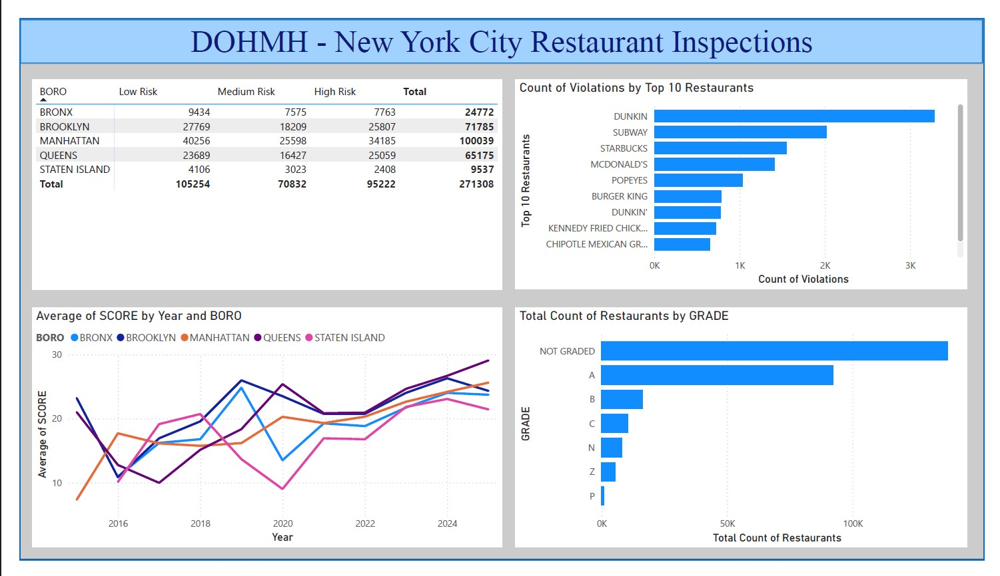
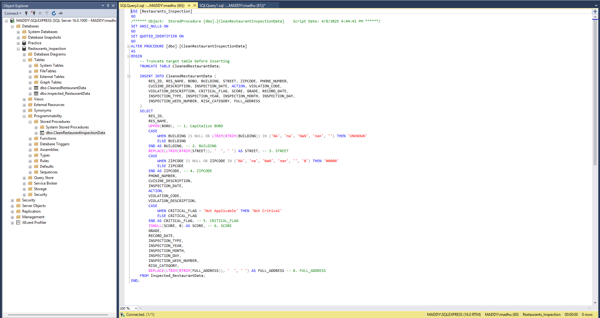
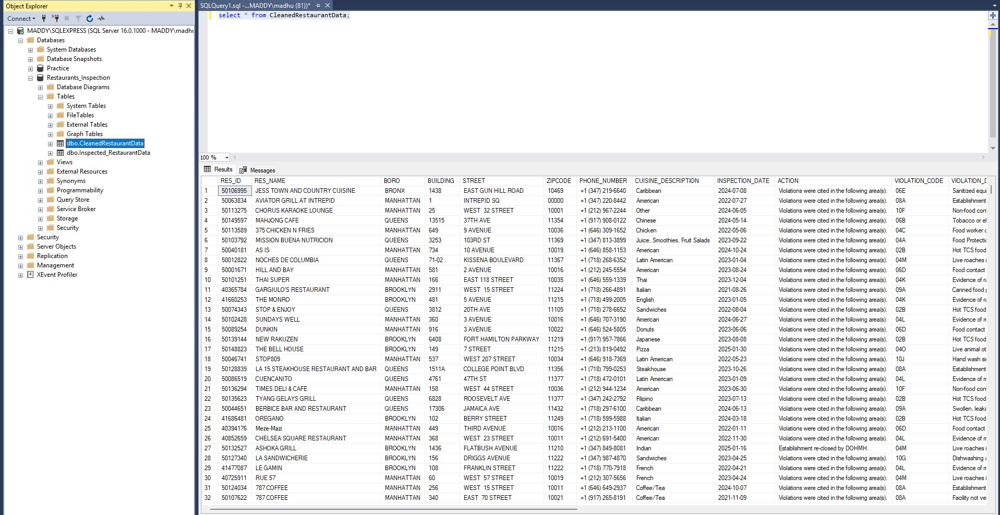
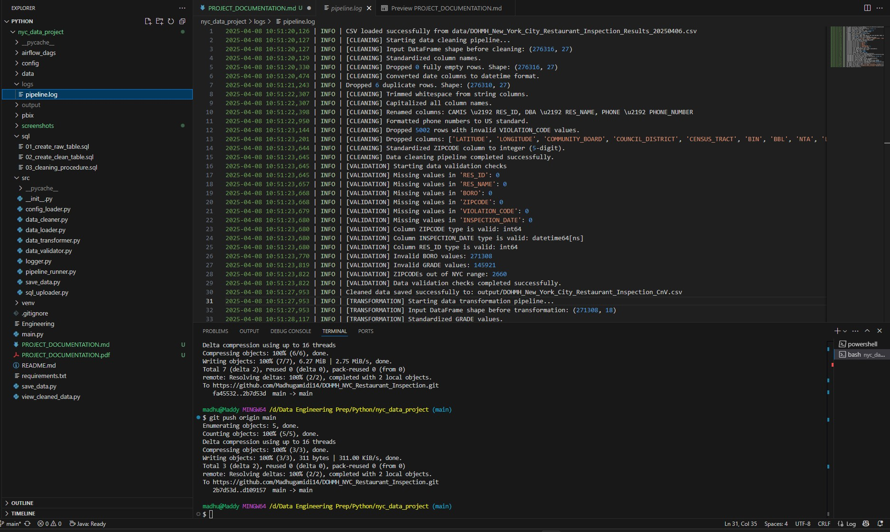

<div align="center">

# Sree Madhuchandra Gamidi

📞 +1 (856) 595-5753  
📧 [madhugamidi1496@gmail.com](mailto:madhugamidi1496@gmail.com)  
🌐 [GitHub: Madhugamidi14](https://github.com/Madhugamidi14)  
🔗 [LinkedIn: Madhu Gamidi](https://www.linkedin.com/in/madhu-gamidi-31976918b/)

</div>

---

## Project Documentation: NYC Restaurant Inspection Data Pipeline

### 🌍 Project Overview
This project is an end-to-end data engineering solution for analyzing and visualizing NYC Restaurant Inspection data. It involves ingesting raw data from the NYC Open Data Portal, cleaning and transforming it, uploading it to SQL Server, and creating insightful Power BI dashboards. The pipeline is fully modular and automated using Apache Airflow.

### 📦 Technologies Used
- **Python** (data ingestion, cleaning, validation, transformation)
- **SQL Server** (data storage and post-upload cleaning)
- **Power BI** (dashboard and visualizations)
- **Apache Airflow** (automation)
- **GitHub** (version control)
- **VS Code + WSL2** (development environment)

### 📂 Data Source
- **Dataset**: NYC Restaurant Inspection Results
- **Source**: [NYC Open Data Portal](https://data.cityofnewyork.us/)
- **Format**: CSV

### 📄 Pipeline Architecture
1. **Data Ingestion**  
   Load CSV into a Pandas DataFrame using `load_csv()`.

2. **Data Cleaning**  
   Standardize column names, remove nulls, format phone numbers, trim whitespaces, etc.

3. **Data Validation**  
   Check for duplicates, missing values, incorrect data types, invalid entries.

4. **Data Transformation**  
   - Capitalize and normalize `GRADE`
   - Create `INSPECTION_YEAR`, `MONTH`, `WEEK_NUMBER`
   - Derive `RISK_CATEGORY` from `SCORE`
   - Combine `BUILDING + STREET + ZIPCODE` into `FULL_ADDRESS`

5. **SQL Server Upload**  
   Cleaned and transformed data is uploaded to SQL Server with automatic table truncation before each run.

6. **Post-upload SQL Cleaning**  
   A stored procedure standardizes `BORO`, replaces nulls, formats ZIPs, and trims addresses.

7. **Power BI Visualizations**  
   Final table from SQL Server is used to build interactive dashboards.

8. **Airflow DAG**  
   Automates the full pipeline from load to upload.

### 🧩 Detailed Modules
#### `data_loader.py`
- Loads the raw CSV using a configurable path from `config.yaml`.

#### `data_cleaner.py`
- Capitalizes headers
- Trims text
- Converts date columns
- Drops irrelevant fields and rows with missing critical data

#### `data_validator.py`
- Logs all nulls and types
- Logs invalid `BORO`, `GRADE`, and out-of-range ZIPs
- Saves duplicates from `RES_ID + INSPECTION_DATE` to file

#### `data_transformer.py`
- Standardizes `GRADE`
- Derives inspection time dimensions
- Categorizes scores into `RISK_CATEGORY`
- Builds `FULL_ADDRESS`

#### `sql_uploader.py`
- Truncates SQL table
- Uploads transformed data
- Calls stored procedure for final SQL clean

#### `airflow_dags/nyc_inspection_dag.py`
- Schedules and runs all steps
- Logs into Airflow UI

### 🗂️ Directory Structure
```
nyc_data_project/
├── src/
│   ├── data_loader.py
│   ├── data_cleaner.py
│   ├── data_validator.py
│   ├── data_transformer.py
│   ├── sql_uploader.py
│   └── pipeline_runner.py
├── config/config.yaml
├── output/
├── logs/
├── airflow_dags/
│   └── nyc_inspection_dag.py
├── main.py
├── README.md
└── powerbi/NYC_Inspection_Report.pbix
```

### 📊 Power BI Dashboard Overview
- **Score Trends**: Line chart over time
- **Top Risky ZIPs**: Bar chart
- **Violations by Cuisine**: Treemap
- **Grades by Borough**: Matrix
- **Risk Category Breakdown**: Pie chart
- **Slicers**: Year, Borough, Cuisine, Grade

> **Note**: The report is built in Power BI Desktop and manually refreshed as Power BI Service is not used.

> 

### ⚖️ SQL Stored Procedure Logic
Executed after upload from Python:
- Uppercases BORO
- Replaces blank BUILDING with 'UNKNOWN'
- Trims `STREET` and `FULL_ADDRESS`
- Sets null/invalid ZIPs to `00000`
- Updates SCORE nulls to 0
- Drops `GRADE_DATE` column

> 

> 

### ✈️ Automation with Airflow
- DAG file: `airflow_dags/nyc_inspection_dag.py`
- Runs the entire ETL pipeline daily (can be changed)
- Modular tasks with logging at each step

### 📝 Pipeline Log Sample
The pipeline logs important events at each stage with tags like [VALIDATION], [TRANSFORMATION], [SQL UPLOAD].


> 

### 📅 Version Control (GitHub)
- Full source code committed
- `.gitignore` excludes sensitive and bulky files
- Power BI `.pbix` file included

### 🔮 Future Enhancements
- CI/CD using GitHub Actions
- Power BI REST API refresh
- Unit tests
- ML for violation prediction
- Publishing to Power BI Service
